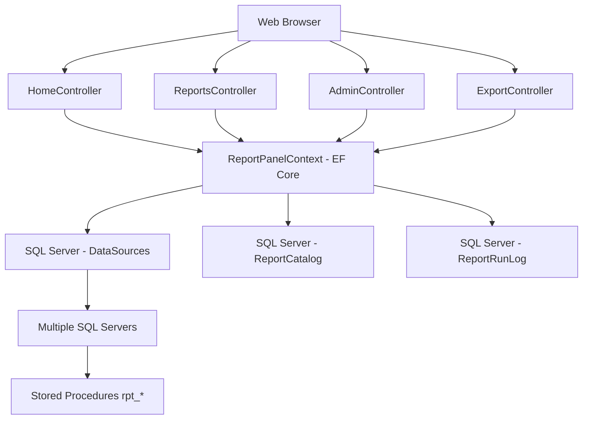

# Tasarım Dokümanı

## Genel Bakış

Minimal Rapor Paneli, ASP.NET Core 8.0 tabanlı, modern ve güvenli bir web uygulamasıdır. Sistem, personelin SQL Server raporlarını güvenli bir şekilde çalıştırabilmesini sağlar. Uygulama, stored procedure tabanlı rapor çalıştırma, parametre doğrulama, Excel/CSV export ve çoklu sunucu desteği sunar.

Sistem MVC pattern kullanarak Controller, Model ve View katmanlarından oluşur. Entity Framework Core ile veritabanı işlemleri gerçekleştirilir. Güvenlik odaklı tasarım, kullanıcıların SQL'e doğrudan erişimini engeller ve tüm veritabanı işlemlerini servis hesabı üzerinden gerçekleştirir.

## Mimari

### Genel Mimari Prensipler

- **Modern MVC Yaklaşım**: ASP.NET Core MVC pattern ile yapılandırılmış mimari
- **Güvenlik Odaklı**: Kullanıcılar SQL yazamaz, sadece önceden tanımlanmış stored procedure'ları çalıştırabilir
- **Çoklu Sunucu Desteği**: Her rapor belirli bir DataSource ile ilişkilendirilir
- **Entity Framework Core**: Code-First yaklaşımı ile veritabanı yönetimi
- **Session Tabanlı Kimlik Doğrulama**: ASP.NET Core session ile oturum yönetimi
- **Audit Trail**: Tüm rapor çalıştırmaları loglanır

### Sistem Bileşenleri



### Dosya Yapısı

```
/ReportPanel/
├── Controllers/
│   ├── HomeController.cs      # Ana sayfa ve kimlik doğrulama
│   ├── ReportsController.cs   # Rapor listesi ve çalıştırma
│   ├── AdminController.cs     # Yönetim paneli
│   └── ExportController.cs    # Excel/CSV export işlemleri
├── Models/
│   ├── DataSource.cs          # Veri kaynağı modeli
│   ├── ReportCatalog.cs       # Rapor kataloğu modeli
│   ├── ReportRunLog.cs        # Çalıştırma log modeli
│   └── ReportPanelContext.cs  # EF Core DbContext
├── Views/
│   ├── Home/                  # Ana sayfa ve login views
│   ├── Reports/               # Rapor views
│   └── Admin/                 # Yönetim paneli views
└── Services/
    ├── ReportService.cs       # Rapor çalıştırma servisi
    └── ExportService.cs       # Export servisi
```

## Bileşenler ve Arayüzler

### 1. AdminController - Yönetim Paneli

Sistem yönetimi controller'ı:

```csharp
// DataSource yönetimi
public async Task<IActionResult> CreateDataSource()
public async Task<IActionResult> EditDataSource(string key)
public async Task<IActionResult> Index() // Ana yönetim paneli

// Rapor yönetimi
public async Task<IActionResult> CreateReport()
public async Task<IActionResult> EditReport(int id)

// POST işlemleri
private async Task HandlePostAction(string action, string key, int id)
```

**Özellikler:**
- ✅ DataSource CRUD işlemleri
- ✅ Kullanıcı dostu form arayüzü
- ✅ Bağlantı string otomatik oluşturma
- ✅ Windows/SQL Authentication seçimi
- ✅ Veritabanı hızlı butonları
- ✅ Form validation
- ✅ Bağlantı testi işlevselliği

### 2. ReportPanelContext - Entity Framework Core

Veritabanı bağlamı:

```csharp
public class ReportPanelContext : DbContext
{
    public DbSet<DataSource> DataSources { get; set; }
    public DbSet<ReportCatalog> ReportCatalog { get; set; }
    public DbSet<ReportRunLog> ReportRunLog { get; set; }
}
```

### 3. Models - Veri Modelleri

**DataSource Model:**
- DataSourceKey (Primary Key)
- Title, ConnString, IsActive
- CreatedAt timestamp

**ReportCatalog Model:**
- ReportId (Identity)
- Title, Description, ProcName
- DataSourceKey (Foreign Key)
- ParamSchemaJson, AllowedRoles
- IsActive, CreatedAt

**ReportRunLog Model:**
- RunId (GUID Primary Key)
- Username, ReportId, DataSourceKey
- ParamsJson, RunAt, DurationMs
- RowCount, IsSuccess, ErrorMessage

### 4. Views - Kullanıcı Arayüzü

**Admin Views:**
- ✅ CreateDataSource.cshtml - Gelişmiş veri kaynağı oluşturma formu
- ✅ EditDataSource.cshtml - Veri kaynağı düzenleme formu
- ✅ Index.cshtml - Ana yönetim paneli
- CreateReport.cshtml - Rapor oluşturma formu
- EditReport.cshtml - Rapor düzenleme formu

### 5. Services (Gelecek Implementasyon)

**ReportService:**
- Stored procedure çalıştırma
- Parametre doğrulama ve tip dönüştürme
- RunLog kaydı oluşturma

**ExportService:**
- Excel/CSV export işlemleri
- PhpSpreadsheet entegrasyonu
- Stream download

## Veri Modelleri

### DataSources Tablosu

```sql
CREATE TABLE DataSources (
    DataSourceKey NVARCHAR(50) PRIMARY KEY,
    Title NVARCHAR(100) NOT NULL,
    ConnString NVARCHAR(1000) NOT NULL,
    IsActive BIT NOT NULL DEFAULT 1,
    CreatedAt DATETIME NOT NULL DEFAULT GETDATE()
);
```

**Alanlar:**
- `DataSourceKey`: Benzersiz tanımlayıcı (örn: "IK", "MALI")
- `Title`: Görüntüleme adı
- `ConnString`: SQL Server bağlantı dizesi
- `IsActive`: Aktiflik durumu
- `CreatedAt`: Oluşturulma tarihi

### ReportCatalog Tablosu

```sql
CREATE TABLE ReportCatalog (
    ReportId INT IDENTITY PRIMARY KEY,
    Title NVARCHAR(200) NOT NULL,
    Description NVARCHAR(500) NULL,
    DataSourceKey NVARCHAR(50) NOT NULL,
    ProcName NVARCHAR(200) NOT NULL,
    ParamSchemaJson NVARCHAR(MAX) NOT NULL,
    AllowedRoles NVARCHAR(200) NOT NULL,
    IsActive BIT NOT NULL DEFAULT 1,
    CreatedAt DATETIME NOT NULL DEFAULT GETDATE(),
    CONSTRAINT FK_ReportCatalog_DataSources 
        FOREIGN KEY (DataSourceKey) REFERENCES DataSources(DataSourceKey)
);
```

**Alanlar:**
- `ReportId`: Otomatik artan birincil anahtar
- `Title`: Rapor başlığı
- `Description`: Rapor açıklaması
- `DataSourceKey`: Hangi sunucuda çalışacağı
- `ProcName`: Stored procedure adı (rpt_ önekli)
- `ParamSchemaJson`: Parametre şeması ve form tanımı
- `AllowedRoles`: Erişim yetkisi olan roller (CSV format)
- `IsActive`: Aktiflik durumu

### ReportRunLog Tablosu

```sql
CREATE TABLE ReportRunLog (
    RunId UNIQUEIDENTIFIER NOT NULL PRIMARY KEY,
    Username NVARCHAR(100) NOT NULL,
    ReportId INT NOT NULL,
    DataSourceKey NVARCHAR(50) NOT NULL,
    ParamsJson NVARCHAR(MAX) NOT NULL,
    RunAt DATETIME NOT NULL DEFAULT GETDATE(),
    DurationMs INT NULL,
    RowCount INT NULL,
    IsSuccess BIT NOT NULL,
    ErrorMessage NVARCHAR(1000) NULL
);
```

**Alanlar:**
- `RunId`: Benzersiz çalıştırma ID'si (GUID)
- `Username`: Çalıştıran kullanıcı
- `ReportId`: Çalıştırılan rapor
- `DataSourceKey`: Kullanılan veri kaynağı
- `ParamsJson`: Kullanılan parametreler (JSON format)
- `RunAt`: Çalıştırma zamanı
- `DurationMs`: Çalıştırma süresi (milisaniye)
- `RowCount`: Dönen satır sayısı
- `IsSuccess`: Başarı durumu
- `ErrorMessage`: Hata mesajı (varsa)

### ParamSchema JSON Formatı

```json
{
    "fields": [
        {
            "name": "StartDate",
            "label": "Başlangıç Tarihi",
            "type": "date",
            "required": true
        },
        {
            "name": "EndDate", 
            "label": "Bitiş Tarihi",
            "type": "date",
            "required": true
        },
        {
            "name": "SubeId",
            "label": "Şube",
            "type": "select",
            "required": false,
            "optionsProc": "dbo.rpt_Lookup_Subeler"
        },
        {
            "name": "IsActive",
            "label": "Sadece Aktif Kayıtlar",
            "type": "checkbox",
            "required": false
        }
    ]
}
```

**Desteklenen Parametre Tipleri:**
- `date`: Tarih seçici
- `text`: Metin girişi
- `number`: Sayı girişi
- `select`: Açılır liste (optionsProc ile doldurulur)
- `checkbox`: Onay kutusu (boolean)
## Correctness Properties

*A property is a characteristic or behavior that should hold true across all valid executions of a system-essentially, a formal statement about what the system should do. Properties serve as the bridge between human-readable specifications and machine-verifiable correctness guarantees.*

Prework analizine dayanarak, aşağıdaki correctness properties tanımlanmıştır:

### Property 1: Güvenli Kimlik Doğrulama
*Herhangi bir* kullanıcı girişi için, sistem SQL Server kimlik bilgileri gerektirmeden kimlik doğrulaması yapmalıdır
**Validates: Requirements 1.1**

### Property 2: Rol Tabanlı Erişim Kontrolü
*Herhangi bir* kullanıcı ve rapor kombinasyonu için, kullanıcı sadece rollerine uygun raporları görebilmelidir
**Validates: Requirements 1.2**

### Property 3: Servis Hesabı Bağlantısı
*Herhangi bir* rapor çalıştırması için, veritabanı bağlantısı sadece önceden tanımlanmış servis hesabı kimlik bilgileri ile yapılmalıdır
**Validates: Requirements 1.3**

### Property 4: SQL Sorgu Gizliliği
*Herhangi bir* rapor sonucu için, çıktı altta yatan SQL sorgularını içermemelidir
**Validates: Requirements 1.5**

### Property 5: Dinamik Form Oluşturma
*Herhangi bir* ParamSchema için, oluşturulan form şemada tanımlanan tüm alanları içermelidir
**Validates: Requirements 2.1**

### Property 6: Parametre Doğrulama
*Herhangi bir* parametre seti için, tüm required alanlar sağlanmadığında sistem çalıştırmayı reddetmelidir
**Validates: Requirements 2.2**

### Property 7: Tip Dönüştürme
*Herhangi bir* parametre değeri için, sistem değeri şemada belirtilen veri tipine doğru dönüştürmelidir
**Validates: Requirements 2.3**

### Property 8: Hata Mesajları
*Herhangi bir* geçersiz parametre girişi için, sistem açık hata mesajları göstermeli ve çalıştırmayı engellemelidir
**Validates: Requirements 2.4**

### Property 9: Parametre Bağlama Güvenliği
*Herhangi bir* geçerli parametre seti için, stored procedure çağrısı parametre binding kullanarak SQL injection'ı önlemelidir
**Validates: Requirements 2.5**

### Property 10: Format Seçimi - XLSX
*Herhangi bir* 200.000 satır veya daha az sonuç seti için, sistem XLSX formatında dosya oluşturmalıdır
**Validates: Requirements 3.2**

### Property 11: Format Seçimi - CSV Fallback
*Herhangi bir* 200.000 satırı aşan sonuç seti için, sistem CSV formatında dosya oluşturmalıdır
**Validates: Requirements 3.3**

### Property 12: Dosya Adlandırma
*Herhangi bir* export işlemi için, oluşturulan dosya adı rapor adını ve zaman damgasını içermelidir
**Validates: Requirements 3.4**

### Property 13: Stream Download
*Herhangi bir* export talebi için, sistem geçici dosya oluşturmadan akış halinde indirme sağlamalıdır
**Validates: Requirements 3.5**

### Property 14: Çoklu DataSource Desteği
*Herhangi bir* DataSource konfigürasyonu için, sistem birden fazla SQL Server bağlantısını saklayabilmelidir
**Validates: Requirements 4.1**

### Property 15: Rapor-DataSource İlişkisi
*Herhangi bir* rapor için, sistem onu tam olarak bir DataSource ile ilişkilendirmelidir
**Validates: Requirements 4.2**

### Property 16: Doğru Sunucu Bağlantısı
*Herhangi bir* rapor çalıştırması için, sistem raporun DataSource konfigürasyonuna göre doğru sunucuya bağlanmalıdır
**Validates: Requirements 4.3**

### Property 17: Aktiflik Kontrolü
*Herhangi bir* pasif DataSource için, sistem ilişkili raporların çalıştırılmasını engellemelidir
**Validates: Requirements 4.4**

### Property 18: Bağlantı Doğrulama
*Herhangi bir* DataSource aktivasyonu için, sistem önceden bağlantı geçerliliğini doğrulamalıdır
**Validates: Requirements 4.5**

### Property 19: Çalıştırma Loglaması
*Herhangi bir* rapor çalıştırması için, sistem RunLog tablosunda metadata kaydı oluşturmalıdır
**Validates: Requirements 5.1**

### Property 20: Log Detayları
*Herhangi bir* log kaydı için, sistem kullanıcı adı, rapor ID'si, parametreler, zaman damgası ve süreyi içermelidir
**Validates: Requirements 5.2**

### Property 21: Başarı Loglaması
*Herhangi bir* başarılı çalıştırma için, sistem satır sayısını ve başarı durumunu loglamalıdır
**Validates: Requirements 5.3**

### Property 22: Hata Loglaması
*Herhangi bir* başarısız çalıştırma için, sistem hata mesajlarını ve başarısızlık detaylarını loglamalıdır
**Validates: Requirements 5.4**

### Property 23: Export Yetkilendirme
*Herhangi bir* export talebi için, sistem RunLog kayıtlarını doğrulayarak süre sınırlarını uygulamalıdır
**Validates: Requirements 5.5**

### Property 24: Stored Procedure Öneki
*Herhangi bir* rapor tanımı için, sistem "rpt_" önekli stored procedure adlarını zorunlu kılmalıdır
**Validates: Requirements 6.1**

### Property 25: SQL Injection Koruması
*Herhangi bir* parametre girişi için, sistem SQL injection saldırılarını parametre binding ile önlemelidir
**Validates: Requirements 6.2**

### Property 26: Parametre Güvenliği
*Herhangi bir* stored procedure çağrısı için, sistem sadece doğrulanmış ve tip dönüştürülmüş parametreleri geçmelidir
**Validates: Requirements 6.3**

### Property 27: Sadece Okuma İşlemleri
*Herhangi bir* stored procedure çalıştırması için, sistem sadece SELECT işlemlerini zorunlu kılmalıdır
**Validates: Requirements 6.4**

### Property 28: Parametre Tipi Desteği
*Herhangi bir* parametre şeması için, sistem date, text, number, select ve checkbox tiplerini desteklemelidir
**Validates: Requirements 6.5**

### Property 29: Önizleme Sınırı
*Herhangi bir* rapor sonucu için, sistem önizlemede maksimum 500 satır göstermelidir
**Validates: Requirements 7.1**

### Property 30: Tablo Formatı
*Herhangi bir* önizleme için, sistem verileri okunabilir HTML tablo formatında göstermelidir
**Validates: Requirements 7.2**

### Property 31: Timeout Kontrolü
*Herhangi bir* sorgu çalıştırması için, sistem 60 saniye sonra çalıştırmayı sonlandırmalıdır
**Validates: Requirements 7.4**

### Property 32: Satır Sayısı Bilgisi
*Herhangi bir* sonuç görüntüleme için, sistem toplam satır sayısı bilgisini göstermelidir
**Validates: Requirements 7.5**

### Property 33: Veritabanı Tabanlı Rapor Yönetimi
*Herhangi bir* yeni rapor için, sistem tanımları Report_Catalog tablosunda saklamalıdır
**Validates: Requirements 8.1**

### Property 34: Rapor Konfigürasyonu
*Herhangi bir* rapor yapılandırması için, sistem başlık, açıklama, stored procedure ve parametre şeması alanlarını işlemelidir
**Validates: Requirements 8.2**

### Property 35: Rol Tabanlı Konfigürasyon
*Herhangi bir* rapor için, sistem AllowedRoles konfigürasyonu ile erişim kontrolünü desteklemelidir
**Validates: Requirements 8.3**

### Property 36: Aktif Rapor Görünürlüğü
*Herhangi bir* pasif rapor için, sistem onu kullanıcı arayüzlerinden gizlemelidir
**Validates: Requirements 8.4**

### Property 37: Dinamik Seçenek Yükleme
*Herhangi bir* select tipli parametre için, sistem optionsProc çalıştırarak seçenekleri doldurmalıdır
**Validates: Requirements 8.5**
## Hata İşleme

### Veritabanı Bağlantı Hataları

- **Bağlantı Başarısızlığı**: DataSource bağlantısı başarısız olduğunda kullanıcıya anlamlı hata mesajı gösterilir
- **Timeout Hataları**: 60 saniye timeout süresi aşıldığında sorgu sonlandırılır ve hata loglanır
- **Stored Procedure Hataları**: SP çalıştırma hatalarında detaylı hata mesajı RunLog'a kaydedilir

### Parametre Doğrulama Hataları

- **Required Alan Kontrolü**: Zorunlu alanlar boş bırakıldığında açık hata mesajları gösterilir
- **Tip Dönüştürme Hataları**: Geçersiz veri tipleri için kullanıcı dostu hata mesajları sağlanır
- **Parametre Şeması Hataları**: Geçersiz JSON şeması durumunda sistem güvenli varsayılan davranış sergiler

### Yetkilendirme Hataları

- **Rol Yetkisi**: Yetkisiz rapor erişimi durumunda 403 Forbidden yanıtı döndürülür
- **Session Timeout**: Oturum süresi dolduğunda kullanıcı login sayfasına yönlendirilir
- **Export Yetkilendirme**: Geçersiz RunId veya süresi dolmuş export talepleri reddedilir

### Export Hataları

- **Dosya Boyutu**: Çok büyük dosyalar için CSV fallback otomatik devreye girer
- **Memory Limit**: PhpSpreadsheet memory limitleri aşıldığında CSV formatına geçiş yapılır
- **Stream Hataları**: Download sırasında bağlantı kopması durumunda partial content desteği

## Test Stratejisi

### İkili Test Yaklaşımı

Sistem hem unit testler hem de property-based testler ile kapsamlı şekilde test edilecektir:

**Unit Testler:**
- Belirli örnekleri, edge case'leri ve hata durumlarını doğrular
- Bileşenler arası entegrasyon noktalarını test eder
- Konkret hataları yakalar ve spesifik davranışları doğrular

**Property-Based Testler:**
- Tüm girişler boyunca geçerli olması gereken evrensel özellikleri doğrular
- Rastgele veri ile geniş kapsamlı test sağlar
- Genel doğruluğu ve sistem davranışının tutarlılığını kontrol eder

### Property-Based Testing Gereksinimleri

- **Test Kütüphanesi**: .NET için FsCheck property-based testing kütüphanesi kullanılacak
- **Minimum İterasyon**: Her property-based test minimum 100 iterasyon çalıştırılacak
- **Test Etiketleme**: Her property-based test şu format ile etiketlenecek: 
  `**Feature: minimal-report-panel, Property {number}: {property_text}**`
- **Tek Property - Tek Test**: Her correctness property tek bir property-based test ile implement edilecek

### Unit Testing Gereksinimleri

- **Spesifik Örnekler**: Doğru davranışı gösteren konkret örnekler test edilecek
- **Edge Case'ler**: Sınır değerleri, boş girişler, maksimum limitler test edilecek
- **Hata Durumları**: Geçersiz girişler, bağlantı hataları, timeout durumları test edilecek
- **Entegrasyon**: Bileşenler arası veri akışı ve API sözleşmeleri test edilecek

### Test Kapsamı

**Güvenlik Testleri:**
- SQL injection koruması
- Parametre binding doğruluğu
- Rol tabanlı erişim kontrolü
- Session güvenliği

**Fonksiyonel Testler:**
- Rapor çalıştırma akışı
- Parametre doğrulama ve tip dönüştürme
- Export işlevselliği (XLSX/CSV)
- Çoklu sunucu desteği

**Performans Testleri:**
- Büyük veri setleri ile export
- Timeout kontrolü
- Memory kullanımı (PhpSpreadsheet)
- Concurrent kullanıcı desteği

**Entegrasyon Testleri:**
- SQL Server bağlantıları
- Stored procedure çağrıları
- Session yönetimi
- Dosya indirme akışı